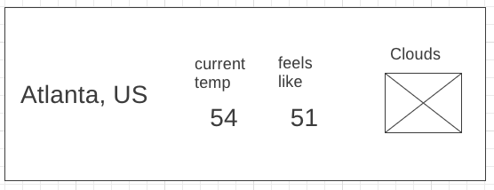

# Weather App

## Technology Used
* HTML
    * Form Inputs
* CSS
    * Responsive Design
    * Flexbox
    * Grid
* JavaScript
    * jQuery DOM Manipulation
* Open Weather API
    * AJAX

## Features
* Display city and date
* Display current temperature
* Display current weather condition

## Wireframes

## Stretch Goals
* Include multiple day forecasts